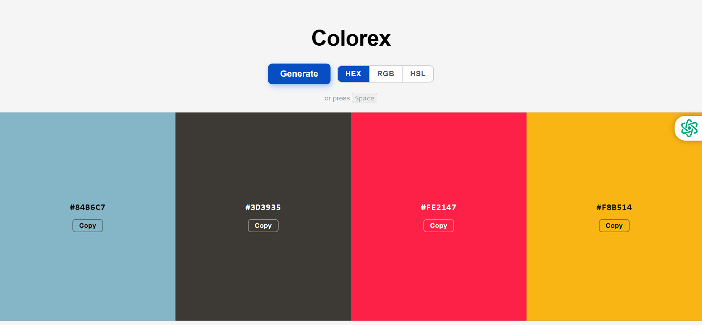

# Color Generator — Smart Palette Tool

A clean, interactive color generator built to help developers and designers quickly generate, preview, and copy color palettes in multiple formats..

## Table of contents

- [Overview](#overview)
- [Key Features](#key-features)
- [Screenshot](#screenshot)
- [Links](#links)
- [Built with](#built-with)
- [My Approach](#my-approach)
- [Future Improvements](#future-improvements)
- [Author](#author)

## Overview

This project solves a simple but common problem:
Developers often need quick access to usable color values in different formats while building interfaces.

### Key Features

- Generate 4 random colors instantly
- Multi-format support : 
  . HEX
  . HSL
  . RGBA
- Copy to clipboard with a single click
- Real-time updates when switching formats
- Responsive UI for desktop and mobile

### Screenshot

### Links

- Live Site URL: [Live Site]( https://dapo-f.github.io/color-generator/)

### Built with

- HTML5 — Semantic structure
- CSS3 — Layout, responsiveness, and styling
- JavaScript (Vanilla) — Core logic and interactivity

### My Approach

I focused on user experience and simplicity:

- Reduced friction → One-click generation & copying
- Flexibility → Users can switch formats without regenerating colors
- Clean UI → Minimal distractions, focus on the colors

### Future Improvements

- Gradient generator
- Save & export palettes
- Accessibility contrast checker
- Custom color controls (sliders)

## Author

- Website - [Adedapo Fagorala]( https://dapo-f.github.io/Adedapo/)

